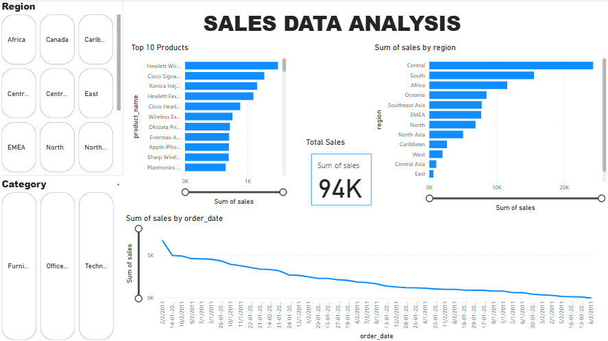
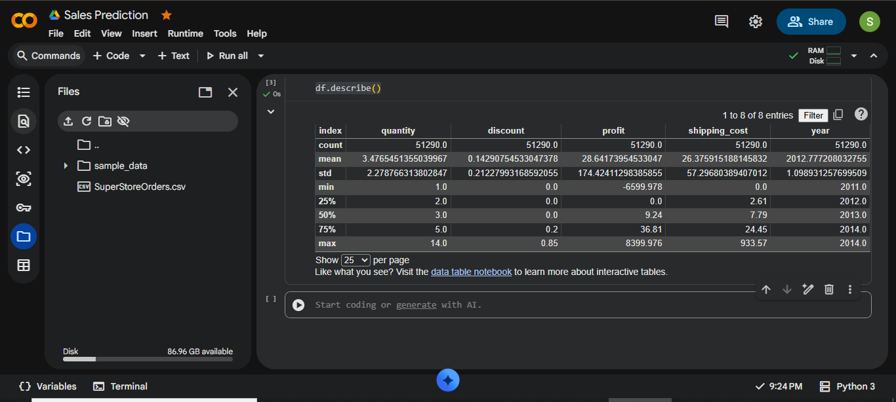
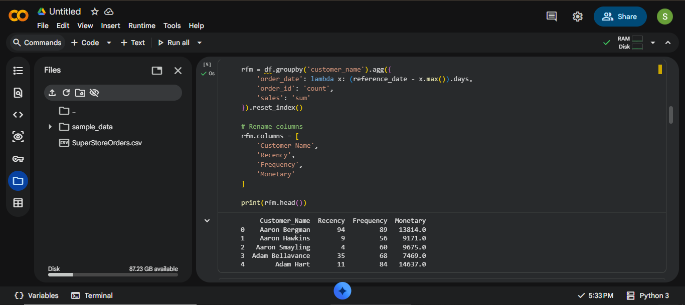

# Retail-Sales-Customer-Intelligence-
Retail sales analytics project using SQL, Power BI, Python, WEKA, forecasting, customer segmentation, and RFM analysis.
Project Screenshots

Dashboard

---

K-Means Clustering

---

K-Means Graph

---

Prediction Graph

---

Prediction Info

---

RFM Analysis

---

RFM Bar Graph

---

RFM Graph

---

RFM Table

